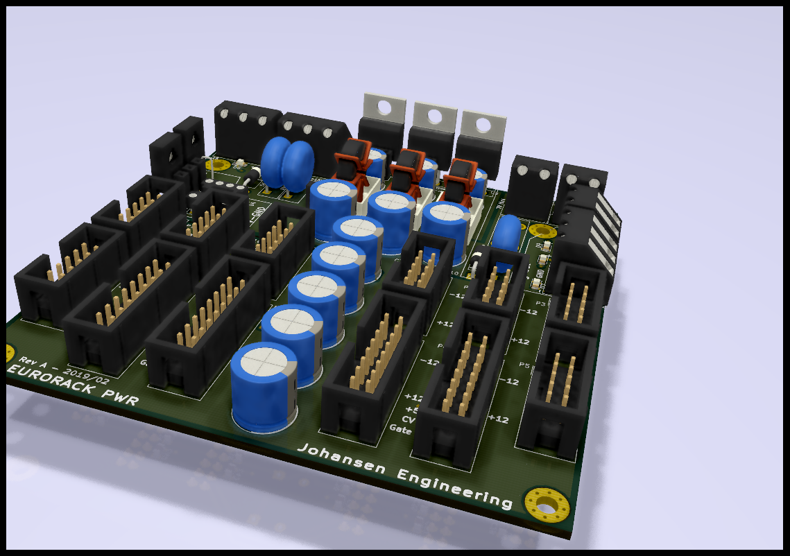

# KicadEuroPowerCon
Powerplane for Eurorack Doepfer connectors

## Status - Rev B board layout and Gerber
### Errata

### Issues and Notes

## Physical Construction
100x100mm
Optional cut in 2 where the top part can be used as a normal regulator board.

## Features
+/- 12V Supply
 - Requires +-14,5v to +-27v. Input can be either linear transformer with/without bridge rectifier, or switched mode. 
 - Max 1,5A will require additional cooling of the regulators and larger diodes.
 - Optional disable regulation
 - Optional synthetic GND if only single ended supply is available.
 
+5V Supply
 - Requires 7-25V input either as linear transformer with/without bridge rectifier, or switched mode PSU.
 - Optional input from +15V thru supply 
 - Max 1,5A will require additional cooling of the regulators and larger diodes.
 - Optional disable regulation

Thru
 - Both 7V and +-15 input sections can be sent thru to a second module for daisy chaining of modules.

Reg out
 - Regulated outputs can be send out to other power distribution modules or directly to Synth modules that does not require the Doepfer 10pin or 16pin power input.
 
## Board Layout
- Top - Power in
- Top Right - Regulated power out
- Bottom - Doepfer Powercon

# Electrical Construction
Intended function

## Schematic

## 3D

