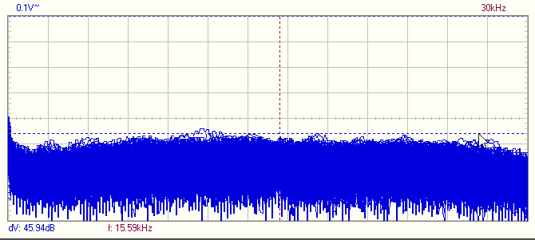

# KicadEuroPowerCon
Powerplane for Eurorack Doepfer connectors

## Status - Rev B board in prototest - Virtual GND fail
### Initial 
| Stage  | Detail | Status |
| ------------- | ------------- | ------------- |
| create material  | sch/pcb | produced Rev B  |
| | gerber | produced and uploaded RevB |
| production  | ordered  | OK |
|  | produced | OK |
|  | delivered | OK |
### Preliminary validation
| Test  | Detail | Status |
| ------------- | ------------- | ------------- |
| Initial Inspection | Visual - Component Mounting | OK |
| Initial Technical Test | +-20V in +9V in | OK |
| | +/-12v out +5V out | OK |
| | LED's | OK |
| Initial Product Test | Powercon burn in with 10pin VCF | OK |
| Initial Product Test | Powercon 16pin |  OK |
| Initial Product Test | Virtual GND | FAIL - see ERRATA - Working after workaround |
| Initial Product Test | 18-24V single ended bypass reg | VCO - OK |
### Secondary validation
| Test  | Detail | Status |
| ------------- | ------------- |------------- |
| Product Test | Powercon burn in 10pin | VCF ok|
| Product Test | Powercon 16pin | VCO ok|
| Quality | Linear Regulator Noise | |
| Quality | Dual 12v Switched Mode PSU Noise | |
| Quality | Single 30v Switched Mode PSU Linear Regulator Noise | |
| Quality | Single 24v Switched Mode PSU Noise | |
| | |Input noise | 
| | |GND noise |  
| | |Output Noise (no 7812/7912 reg) | 
| Long Term Product Test | | ongoing |

 
### Errata
 * Q2 BD140 err in schematic - C and E flipped by mistake
 * Q2 Pin 1 and R11 connected to GND by mistake.
 
### Issues and Notes
 * fuse holder for +5V should be changed
 * virtual GND should be powered behind fuse
 
## Physical Construction
100x100mm
Optional cut in 2 where the top part can be used as a normal regulator board.

## Features
+/- 12V Supply
 - Requires +-14,5v to +-27v. Input can be either linear transformer with/without bridge rectifier, or switched mode. 
 - Max 1,5A will require additional cooling of the regulators and larger diodes.
 - Optional disable regulation
 - Optional synthetic GND if only single ended supply is available.
 
+5V Supply
 - Requires 7-25V input either as linear transformer with/without bridge rectifier, or switched mode PSU.
 - Optional input from +15V thru supply 
 - Max 1,5A will require additional cooling of the regulators and larger diodes.
 - Optional disable regulation

Thru
 - Both 7V and +-15 input sections can be sent thru to a second module for daisy chaining of modules.

Reg out
 - Regulated outputs can be send out to other power distribution modules or directly to Synth modules that does not require the Doepfer 10pin or 16pin power input.
 
## Board Layout
- Top - Power in
- Top Right - Regulated power out
- Bottom - Doepfer Powercon

# Electrical Construction
Intended function

## Schematic

## 3D

